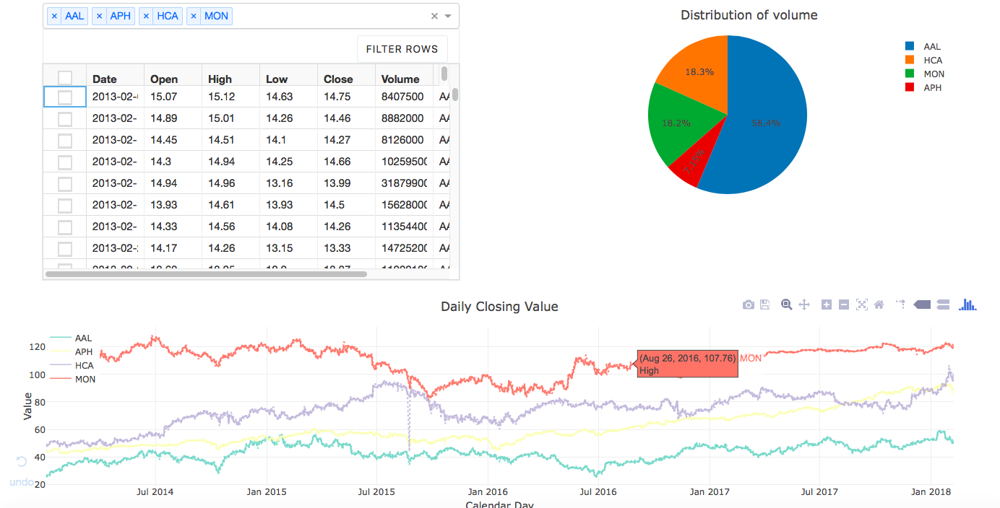

# dash_

## What is it?
This is repo is used to display interactive app powered by [Dash](https://plot.ly/products/dash/) (Dash is a Python framework for building analytical web applications.).

Click here to see [Dash gallery](https://dash.plot.ly/gallery) 

## Main Features
This dashboard uses the Kaggle data ['S&P 500 stock data - Historical stock data for all current S&P 500' companies'](https://www.kaggle.com/camnugent/sandp500/data)

Here are the 3 data that you can analyse with the dashboard:
* Raw data in a table
* Pie chart of the average ratio of the stock volume over the time period selected
* Time Series of the stock selected over the time period selected
* High and Low value of each stock selected

## Screenshot


<p align="center"><a href="https://imgflip.com/gif/28g0e6"></a>

## Where to get it
* Clone the repo
* Will later by deploy on AWS

## Pip install dependencies
Make sure you have installed the following 

```
pip install pandas 
pip install numpy
pip install dash
pip install dash_core_components
pip install dash_html_components
pip install dash_colorscales
pip install plotly
pip install dash.dependencies
pip install colorlover 
```

# Dependencies
* Dash:

dash==0.21.0

dash-colorscales==0.0.4

dash-core-components==0.22.0

dash-html-components==0.10.0

dash-renderer==0.12.1

dash-table-experiments==0.6.0

* Flask:

Flask==0.12.2

Flask-Compress==1.4.0

Flask-Cors==3.0.2

* Jupyter:

jupyter==1.0.0

jupyterlab==0.31.8

* Numpy, Pandas:

numpy==1.14.1

pandas==0.22.0

## Getting Help
Please open an issue
